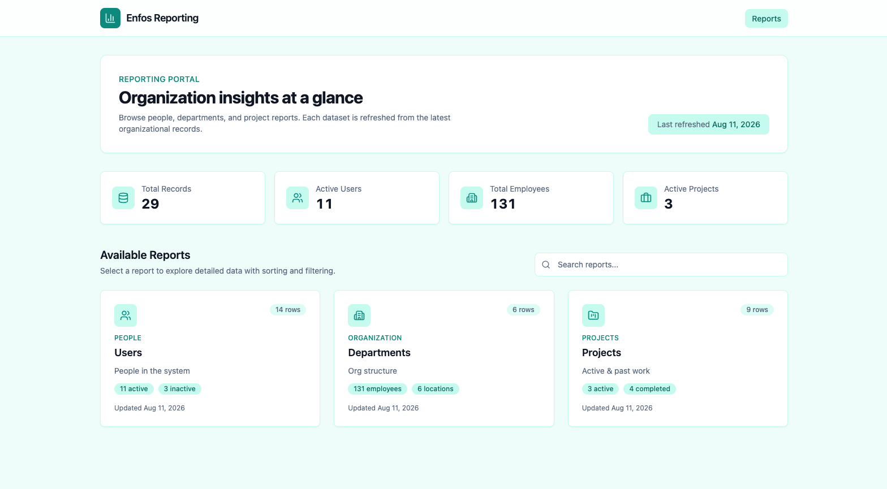
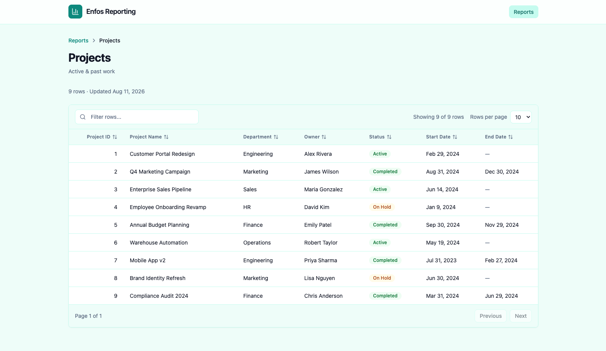
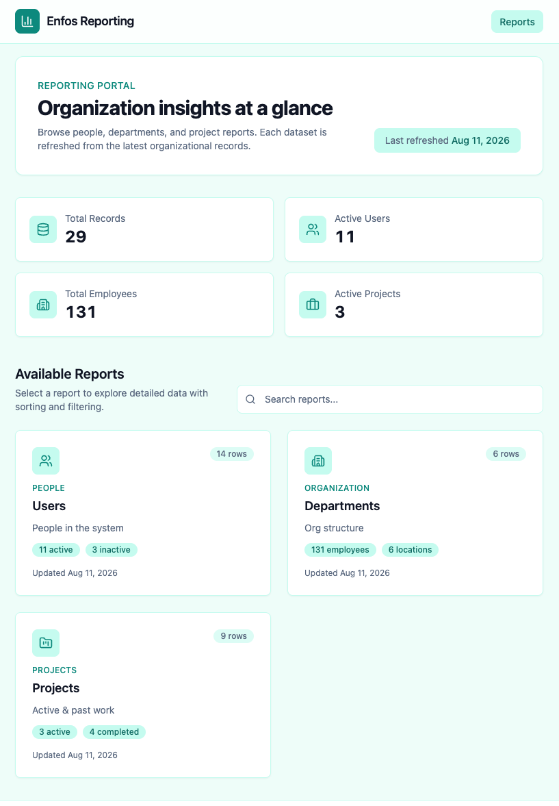
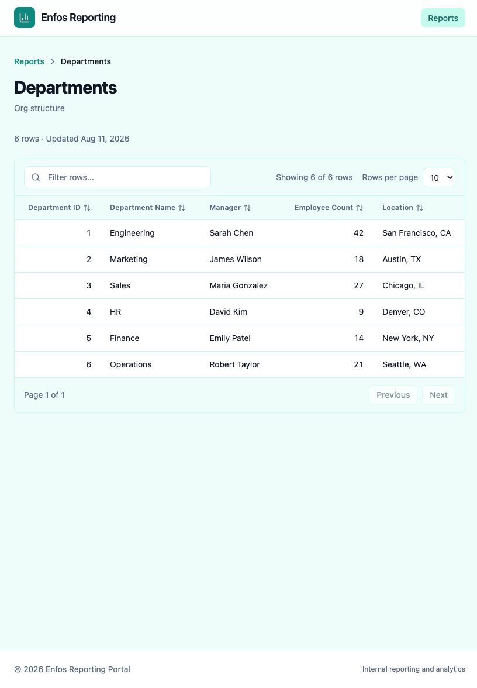
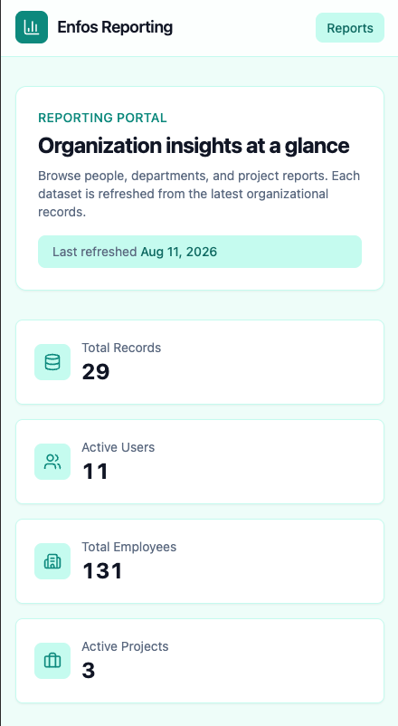
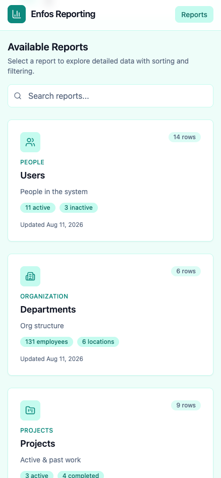
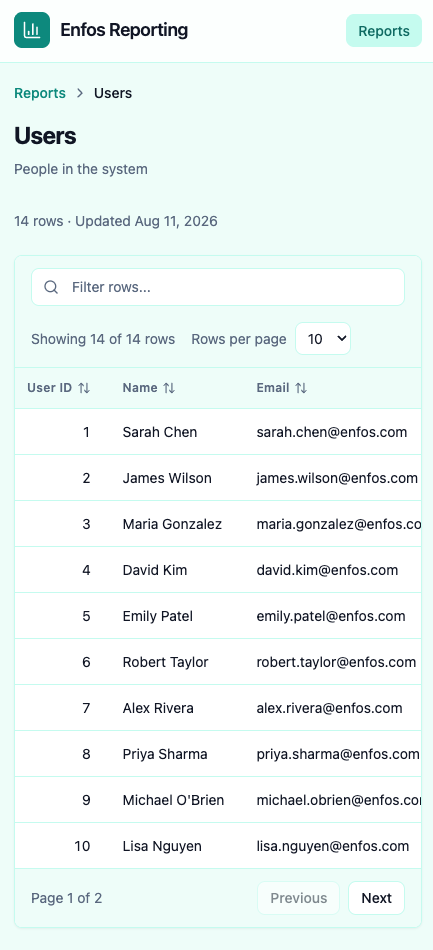
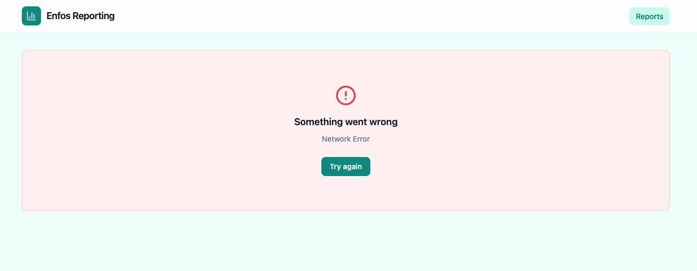

# ENFOS Reporting Portal

An internal reporting portal where users browse available reports (Users, Departments, Projects) and view their data in interactive, data-driven tables. The frontend is a React + TypeScript SPA; the backend is a Spring Boot REST API backed by an in-memory H2 database that auto-seeds on startup.

## Prerequisites

- [Docker](https://docs.docker.com/get-docker/)
- [Docker Compose](https://docs.docker.com/compose/install/)

No other tools are required to run the full stack.

## How to Run

From the project root:

```bash
docker compose up --build
```

Wait until the backend healthcheck passes and the frontend container starts. The first build may take a few minutes while Maven and npm dependencies download.

**Note:** Ensure ports `8080` and `3000` are free. Stop any locally running backend or frontend dev servers before starting Docker.

## How to Access

- **Application (UI):** [http://localhost:3000](http://localhost:3000)
- **API (direct):** [http://localhost:8080/api/reports](http://localhost:8080/api/reports) · [Dashboard](http://localhost:8080/api/dashboard)

## How to Stop

```bash
docker compose down
```


## Architecture Overview

```
Browser → nginx (frontend :3000)
              ├── static React SPA
              └── /api/* → Spring Boot (backend :8080)
                                    └── H2 in-memory DB (auto-seeded)
```


| Layer      | Stack                                                                          |
| ---------- | ------------------------------------------------------------------------------ |
| Frontend   | React 18, TypeScript, Vite, TailwindCSS, TanStack Query, Zustand, React Router |
| Backend    | Java 17, Spring Boot 3, Spring Data JPA, H2, Lombok                            |
| Deployment | Docker Compose, nginx reverse proxy, multi-stage builds                        |


**Request flow:** The landing page fetches aggregate metrics and enriched report metadata from `GET /api/dashboard`. Clicking a report navigates to `/reports/:id`, which fetches column definitions and rows from `GET /api/reports/{users|departments|projects}`. The `DataTable` component renders columns dynamically from the API response and supports client-side sorting, filtering, and pagination.

### GET /api/dashboard

Returns portal summary stats plus enriched report cards (category and per-report highlights):

```json
{
  "summary": {
    "totalRecords": 29,
    "activeUsers": 11,
    "inactiveUsers": 3,
    "totalEmployees": 131,
    "activeProjects": 3,
    "onHoldProjects": 2,
    "completedProjects": 4,
    "lastRefreshed": "2025-01-15T10:30:00"
  },
  "reports": [
    {
      "id": "users",
      "name": "Users",
      "description": "People in the system",
      "lastUpdated": "2025-01-15T10:30:00",
      "rowCount": 14,
      "icon": "users",
      "category": "People",
      "highlights": [
        { "label": "active", "value": "11" },
        { "label": "inactive", "value": "3" }
      ]
    }
  ]
}
```

The existing `GET /api/reports` endpoint remains available for backward compatibility.

## Assumptions and Tradeoffs

- **Flat reporting schema** — `department` and `manager` fields are plain strings, not foreign keys. This keeps the API simple and avoids JOINs for a read-only reporting tool.
- **H2 in-memory** — Data resets on restart (`create-drop`). Suitable for assessment/demo; not for production persistence.
- **Auto-seed on startup** — `DataInitializer` seeds when tables are empty. `POST /api/admin/seed` wipes and re-inserts for manual refresh.
- **Separate report endpoints** — Three detail endpoints (`/users`, `/departments`, `/projects`) plus a metadata list endpoint, as required by the spec.
- **Column metadata from backend** — The frontend table is generic; column keys, labels, and types come from the API.
- **Client-side search and tables** — The landing page filters reports by name, description, or category in the browser. Report detail tables support client-side sort, filter, and pagination.
- **Skeleton loading** — Tailwind `animate-pulse` skeletons instead of spinners or a skeleton library.
- **No auth** — Internal tool assumption; no login or authorization layer.


## Demo
## 🎥 Demo
[](https://www.youtube.com/watch?v=JV_CEbmT0N8)

## Screenshots

### Desktop View
#### Dashboard


#### Report Detail


### Tablet View
#### Dashboard


#### Report Detail


### Mobile View
#### Dashboard




### Report Detail


### Error State
